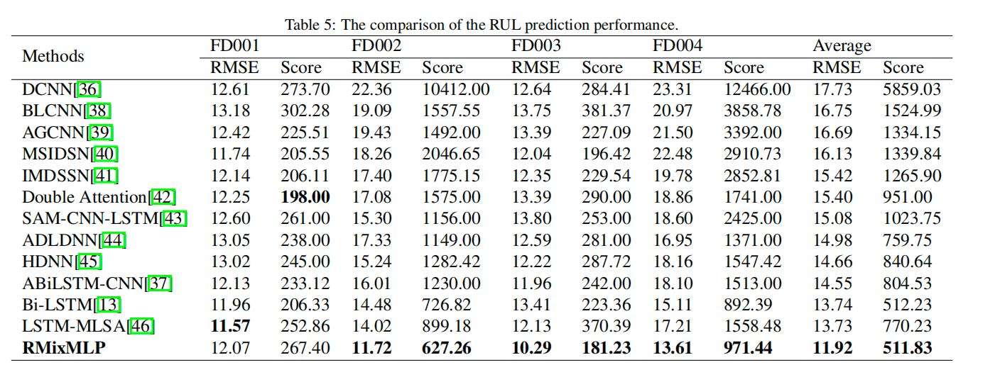

# RMixMLP:An all-MLP Block for machine remaining useful life prediction

This repo is the official Pytorch implementation of RMixMLP: "[RMixMLP:An all-MLP Block for machine remaining useful life prediction]". 


## Updates
- [2023/07/24] We update some scripts and code of RMixMLP. 

## Detailed Description
We provide all experiment script files in `./scripts`:
| Files      |                              Interpretation                          |
| ------------- | -------------------------------------------------------| 
| EXP-BEST      | The best result RUL prediction Task                   |
| EXP-Lyaers      | Study the impact of different number of RMixMLP blocks  | 
| EXP-Learning_rate      | Study the impact of different learning_rate   | 
| EXP-BatchSize      | Study the impact of different batchsize  | 
| EXP-TimeWindow      | Study the impact of different timewindow  | 
| EXP-RULPredLength      | Study the impact of different RUL prediction length  | 
| EXP-Loss        | Study the effects of different loss      |
| EXP-Layers_r_times        | Study the effects of different the number of RMixMLP blocks and Cycle      |


This code is simply built on the code base of DLinear. We appreciate the following GitHub repos a lot for their valuable code base or datasets:

The implementation of DLinear is from https://github.com/cure-lab/LTSF-Linear.git

## RMixMLP

### Comparison with state-of-the-art approaches

RMixMLP outperforms all state-of-the-art methods by a large margin.

## Getting Started
### Environment Requirements

First, please make sure you have installed Conda. Then, our environment can be installed by:
```
conda create -n RMixMLP python=3.8
conda activate RMixMLP
pip install -r requirements.txt
```

### Data Preparation

This repository comes with the C-MPASS dataset, data openly available in a public repository. The dataset was provided by the Prognostics CoE at NASA Ames. We can visit \protect\url{https://ti.arc.nasa.gov/tech/dash/groups/pcoe/prognostic-data-repository/} to get it, and the name is “Turbofan Engine Degradation Simulation Data Set.” The dataset is in the text format and has been zipped including a readme file. 

### Training Example
- In `scripts/ `, we provide the model implementation *RMixMLP*
For example:

To train the **RMixMLP** on **C-MPASS dataset**, you can use the scipt `scripts/EXP-Best/FD_Best.sh`:
```
sh scripts/EXP-Best/FD_Best.sh
``` 

## Citing

If you find this repository useful for your work, please consider citing it as follows:

```bibtex
@inproceedings{
  author={Jinning Qin, Yanyan Wanga, Honglin Zhang, Xurui Ma, Shunran Song},
  title={RMixMLP: An all-MLP Block for machine remaining useful life prediction},
  year={2023}
}
```

Please remember to cite all the datasets and compared methods if you use them in your experiments.
